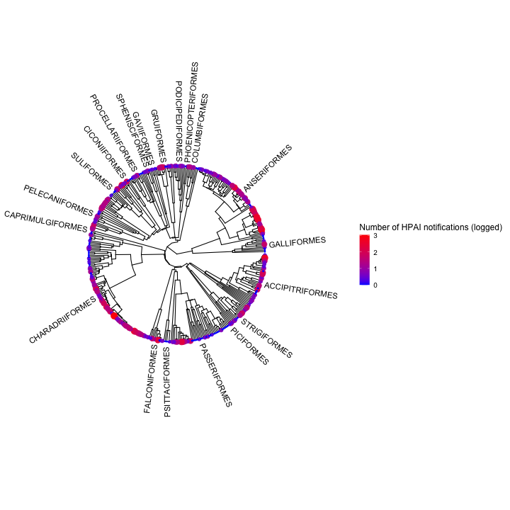
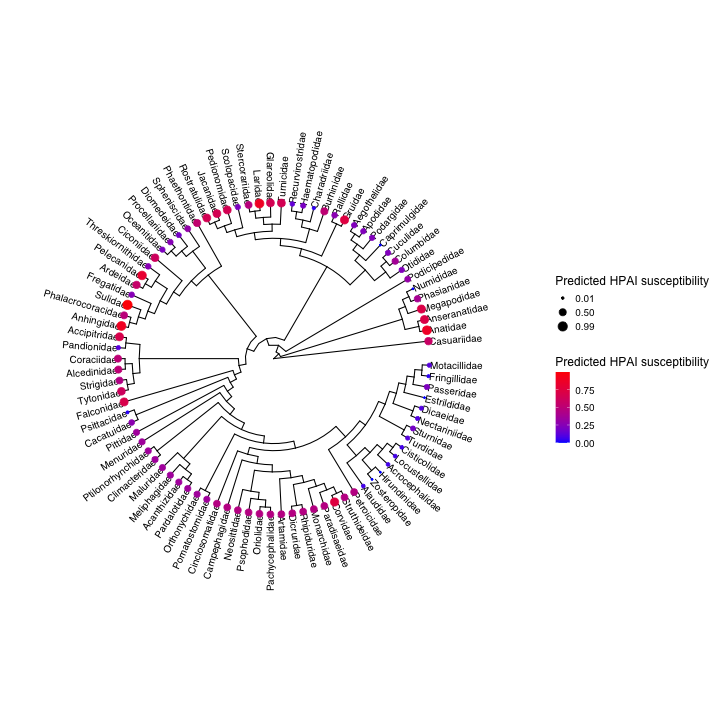

The aim of this document is to predict susceptibility of Australian birds to Highly Pathogenic Avian Influenza Clade 2.3.4.4b (hereon, HPAI). We do this using a phylogenetic modelling approach, where we apply a family-level phylogenetic model on the HPAI notifications from the current panzootic, to determine the phylogenetic signal in HPAI susceptibility. Outbreak data was retrieved from WAHIS (World Animal Health Information System) of the World Organisation for Animal Health (WOAH) on 06/01/2025. 

Since genetically related species importantly also share physiological, behavioural and ecological characteristics, our approach of using family-level phylogenetic signal also serves as a proxy for species sharing similar habitats/ecologies. Thus, we assume that the phylogeny of birds also informs on the specific environmental conditions they prefer (e.g. freshwater habitats), their specific behaviours (e.g. colony breeding), and foraging strategies (e.g. scavenging) and therewith their propensity to become infected with HPAI.  In other words, we assume that species in a family are similarly susceptible, regardless of how common those species are and how often those species may have or may not have been tested for HPAI. We elaborate more on the validity of this approach in the "Why using family, rather than ecological traits, makes sense for predicting HPAI" section, and on the assumptions and caveats of this analysis in the "Data comments" section below. 

Since HPAI susceptibility is likely importantly determined by the preferred environmental conditions, specific behaviours, foraging strategies and other behavioural and ecological conditions, we would like to stress that our analysis predicts disease susceptibility in *natural* settings and not necessarily for birds in captivity. As is obvious from the current panzootic, we should assume that the disease *can* spread to all species of birds. 

## Step one: modelling outbreak prevalence among avian families

The first step in our analysis is to model the number of HPAI notifications of the current avian influenza panzootic to determine the phylogenetic signal. The HPAI notifications in our dataset are all since October 2021 and are all from outside of Australia, and have been reported to the WOAH-WAHIS database. While not all cases are confirmed to be HPAI clade 2.3.4.4b, this is most likely the case for the vast majority. The model includes a family-level phylogeny of affected birds, from [Kuhl et al. 2021](https://doi.org/10.1093/molbev/msaa191).




The model reports a statistically significant phylogenetic signal (on a scale of 0-1, Pagel's lambda: 0.91, 95% CI: 0.54 - 1.00), and the phylogeny shows clusterings of outbreaks amongst **ducks and geese** (Anseriformes), **seabirds** (Suliformes), **shorebirds** (Charadriiformes), **birds of prey** (Accipitriformes and Falconiformes), and **crows** (within Passeriformes).

## Step two: Predicting susceptibility to HPAI outbreaks in Australian species

We used the above model to predict which Australian species are likely to be particularly susceptible to HPAI outbreaks, again using a family-level phylogeny. The list of Australian birds we used is the [BirdLife Working List of Australian Birds](https://birdata.birdlife.org.au/whats-in-a-name), which has been pruned to exclude rare vagrants and very uncommon non-native species. Susceptibility to HPAI outbreaks was expressed on a scale from 0-1. This score was based on the predicted number of HPAI notifications by the model outlined above, where 80 predicted notifications represented a susceptibility index of 1.  We deemed any species that had an estimated HPAI susceptibility index of 0.5 or more as being moderately susceptible, and 0.8 or more as being highly susceptible. 




Lastly, we present a full list of HPAI outbreak susceptibility for all Australian species. While not used in calculating their susceptibility index (again, only phylogeny was used to that effect), aside from susceptibility index, the table also includes some of the key ecological attributes that are thought important in determining species' outbreak susceptibility. The ecological traits include whether it congregates or not, whether it breeds in colonies, and its predominant habitat and diet. The list is currently ordered by families with the highest estimated outbreaks, but can be ordered based on other columns by interacting with the column headings. The table can also be downloaded using a range of formats.


```
## Error in loadNamespace(name): there is no package called 'webshot'
```

## Why using family, rather than ecological traits, makes sense for predicting HPAI

In the approach outlined above, we use family-level phylogeny to understand and predict HPAI susceptibility. Some of the feedback we've received to date has questioned why we did not use ecological traits, like habitat, diet, and tendency to congregate, to model HPAI notifications. Below, we outline why using ecological traits may be confounding, and why family very adequately accounts for much ecological information on the various species.  

The heatmap below shows total number of HPAI notifications in birds with different diet and habitats, separated by whether they congregate or not. The numbers inside the tiles will update automatically when a family is chosen. When "All" is selected, it shows the total number of species that fit that description. When one of the key families is selected, it will show the proportion of species in that category that are part of the selected family. Furthermore, when a family is selected, the heatmap will update to show total number of notifications for that family.  

The aim of this is to show that broad categorisations like "freshwater" or "predator" are not insightful by themselves - they interact with other categories. For example, it is only congregating freshwater birds with plant-based diets that have many HPAI notifications. By selecting different families, it should become clear how Family, as a taxonomic grouping, accounts for many such interactions - ducks disproportionately account for the freshwater birds with plant-based diets, for example. Hence, our approach of using family-level phylogeny accounts for considerable ecological information, and therefore provides a valid basis for our predictions of which Australian birds may be susceptible to HPAI.


```
## Error in loadNamespace(name): there is no package called 'webshot'
```

```
## Error in loadNamespace(name): there is no package called 'webshot'
```

## Data comments and caveats

The predictions in this document come with a number of caveats. The most obvious one is that the dataset we train our first model on contains *reported* outbreaks of avian influenza - that means there is likely some bias in which species are being tested, and where those species occur ([Klaassen and Wille 2023](https://doi.org/10.1038/s41559-023-02182-x)). We might therefore be underestimating outbreaks in rarer bird families or those that occur in more remote areas. 

We also use the family-level phylogeny to infer species with similar ecological traits. This is very likely to be true- closely related species do tend to share similar habitats and traits. We explored other analyses to see if ecological traits could predict disease outbreaks, using trait databases like Avonet and EltonTraits, but found that they often had slightly arbitrary trait designations for species that we know share very similar ecologies. Therefore, we decided to not pursue this approach, and instead use family-level groupings to infer their ecological, behavioural and physiological traits.   


